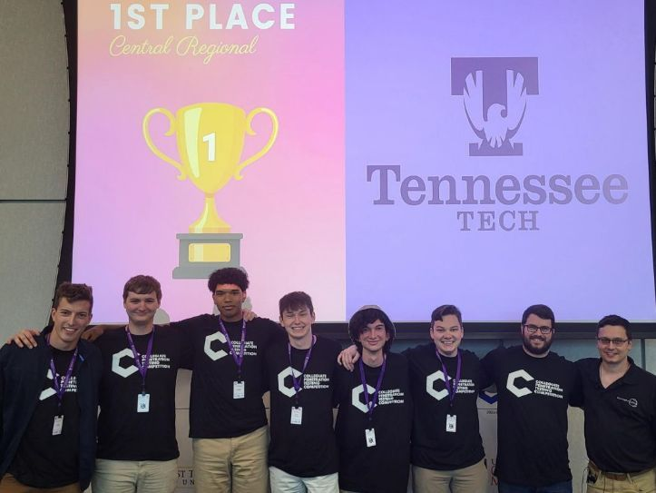
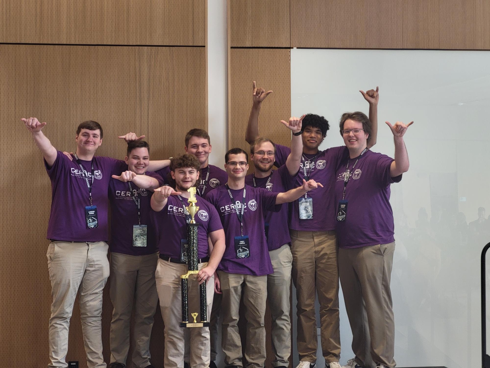

Hello! My name is Landon Foister. This first post serve a high-level overview of what I have done so far throughout my college experience. 

{/* truncate */}

## Pre-College
I believe I had a great foundation going into college at Tennessee Tech. My Computer Science Teacher taught me the methodologies, ideals, and fundamentals that got me ahead of the curve. Development of C, C#, and JavaScript helped me to understand OOP, pointers, and development cycles. 

I competed in CyberPatriot for 2 years. In Tennessee, my team placed 1st, with me as the team captain. This gave me an introduction to a lot of practical skills:

- PowerShell Scripting
- MITRE ATT&CK Framework
- Creative Thinking
- Leadership Skills

#### Certifications
I also was able to pick up `CompTIA ITF+` via my highschools program and `SANS GIAC` via being in a top percentage of people doing CyberStart America.

## Year 1 

### CyberForce
CyberForce was the first team tryout of the year and had the most participants. This was also in my first week of college, so getting adjusted to everything was a little difficult. 

There were times I became avoidant during the week-long tryout, ultimately wasting a lot of time. I did decently, but I fell short. The pressure of making the team got to me. CyberChef could not detect the image file the first time, so I turned in the last flag I needed to qualify for the team 20 seconds late. This is ultimately something that led my resolve to grow to a new level I hadn't felt before.

___

### CPTC

The next competition was in an area I had very little experience in. My previous Computer Science teacher was great at teaching me defensive security, but he refused to teach me offensive security.

There was very little attack surface on the tryouts subnet. All I was able to report was a basic SQL injection via SQLMap on a website and configurations that were not best practices. I thought that I was not going to make the team.

To my surprise, while sitting in my math class, I received a notification saying that I made the team. There were a lot of people who saw potential in me that I had not surfaced yet, who pulled for me to make it. After that news, I started grinding HackTheBox. Every week, there was a HackTheBox write-up due to the team.

#### Central Regionals

Regionals were both very exciting and extremely nerve-racking for me. It was the first time I had to step up for a competition. The bulk of my work was writing up vulnerabilities found by senior members of the team. I was responsible for writing the Active Directory vulnerabilities and misconfigurations for the main report using GhostWriter. Vulnerabilities like

- Constrained & Unconstrained Delegation
- Anonymous LDAP
- Kerberoastable Users with weak passwords
- Hardcoded Credentials
- Password Policies

Thanks mostly to my teammates, we placed first at regionals. This event is what hooked me into wanting to win every competition available. 

The main takeaways I had from this competition were that I needed to better understand Active Directory, and I needed to manage my stress better. This led me to start my month-long training arc for Globals.

#### Training Arc

To learn more about Active Directory pentesting/red teaming, I purchased CTRO, not knowing this would be life-changing.

Experiencing with Cobalt Strike while learning AD pentesting was one of the most enjoyable experiences I’ve ever had. For someone who had limited knowledge in this area, purchasing this course was like a medieval surf receiving the Library of Alexandria.

Learning basic and advanced AD topics, such as AD Trusts, Kerberos Attacks, ADCS, and Windows Defender, strengthened my skills as a pentester and report writer. I passed the exam while packing for CPTC Globals in Rochester, New York.

#### Globals

Globals was very different in terms of in-person interactions. Organizers visited 7-8 times a day to review team processes and actions. They also checked for technical knowledge.

In the end, we lost first place because of a giant 5% penalty. We added a Domain Administrator to make it easier to navigate and gather information for our report, which, in our defense, had never been assessed as a penalty in the 2 years the competition has had Active Directory. I think this is one of the parts of the competition that makes CPTC unique. You have to be adaptable and careful in your approach and willing to work with the client, even if there are no pre-existing rules of engagement, and they make stuff up on the spot.

___

### CCDC

Here is the crown jewel of the accomplishments for year 1.

CCDC came more naturally to me than CPTC because I adapted to thinking defensively during my CyberPatriot days. I was selected as the Windows Lead for my team because most people wanted to work on Linux or the firewall. This started my partnership with Carter Haney, who I consider to be my favorite person to work with ever.

We used the time over winter break and after CPTC Globals to improve our tooling, Windows internals knowledge, and red-teaming experience. We built mostly on what tooling Cal Poly had used during their CCDC finals run to get second place. This included Run.ps1, a PowerShell script that uses credential files to execute scripts and commands over WinRM. If you want to see an improved version of this tool, reworked in Python, please check out Tomoe.

#### Qualifiers

The first round was Qualifiers, where we placed 2nd to six-time first-place winners at nationals, the University of Central Florida. This placement made us aware that we needed much more practice with our tools and procedures. It was going to be a tall task to beat them at Regionals.

#### Training

To prepare for regionals, leveraged our alternates and a few team members to create internal mock competitions. These allowed team members to get increased experience against injects and red-teamers. This was the bulk of our preparation and contributed massively to revealing our blind spots.

#### Regionals

Regionals were a magical experience I had never felt before. Walking into see the top 8 teams in our region, the competition organizers, and our battlefield for the next two days was an amazing feeling.

My stress management was way better at this, as I had taken time to feel prepared and at peace. I had partial responsibility to protect a salt master used to administer commands to Windows machines, only accessible via salt. There were also two Windows domains split between Carter and me. Red-team preparedness was also high. My favorite story from the competition was the moment I randomly tried logging in with the password Nosferatu, and to my horror, it worked. This was the effect of an NTLM being injected into LSASS called nosferatu. From that point forward, all of our blue-team users were Dracula-themed.

In the end, we placed first, beating out our biggest competition, UCF. This was definitely the most nervous I had ever been, and the feeling of victory was something only felt before at CPTC regionals, but this had definitely surpassed it.

